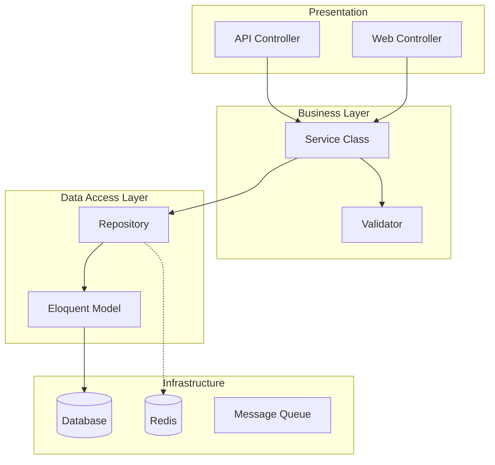
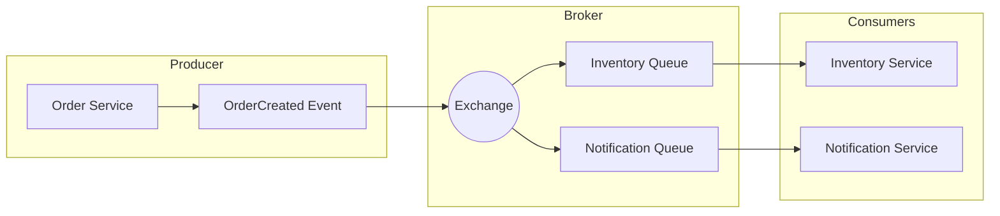

# Architecture Templates

Use these Mermaid templates to quickly visualize system designs.

## Layered Architecture (Standard)



## Hexagonal Architecture (Ports & Adapters)

```mermaid
graph TB
    subgraph Core["Domain Core"]
        Entity[Domain Entity]
        UseCase[Use Case / Service]
        PortIn[Input Port (Interface)]
        PortOut[Output Port (Interface)]
    end

    subgraph AdaptersIn["Primary Adapters"]
        Web[Web Controller]
        CLI[Console Command]
    end

    subgraph AdaptersOut["Secondary Adapters"]
        DBAdapter[Persistence Adapter]
        EmailAdapter[Email Adapter]
    end

    Web --> PortIn
    CLI --> PortIn
    PortIn -.-> UseCase
    UseCase --> Entity
    UseCase --> PortOut
    DBAdapter -.-> PortOut
    EmailAdapter -.-> PortOut
```

## Event-Driven Architecture


